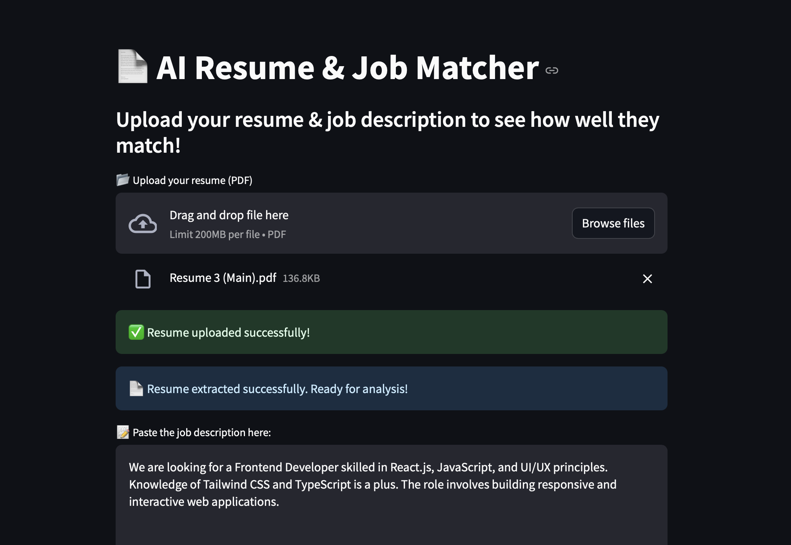
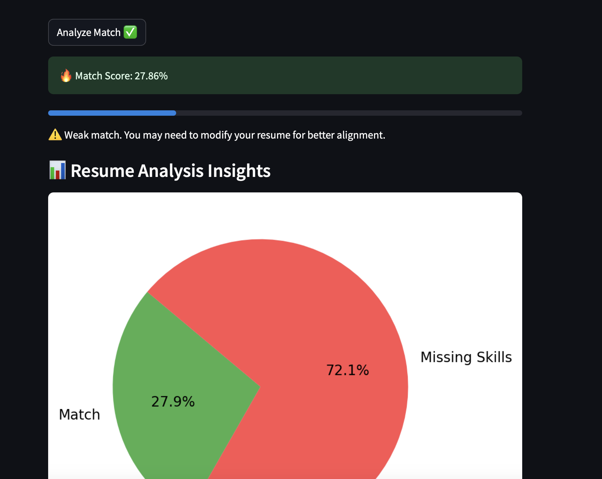
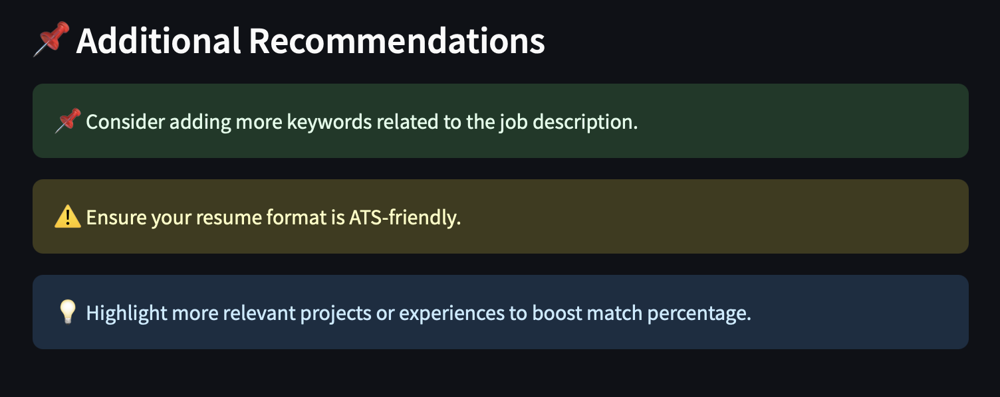

# 📄 AI Resume & Job Matcher

## 🚀 Overview
This project is an **AI-powered Resume Checker** that evaluates how well a resume matches a given job description. It uses **Natural Language Processing (NLP)** to analyze the similarity between resumes and job descriptions, providing a match score to help users improve their job applications.

## 🎯 Features
- 📂 **Upload Resume (PDF)** – Extracts text from uploaded PDF resumes.
- 📝 **Paste Job Description** – Users can enter the job posting for analysis.
- 🔍 **AI-Based Matching** – Uses a powerful **pre-trained NLP model** to evaluate match scores.
- 📊 **Visual Feedback** – Displays match percentage and suggestions for improvement.
- 🚨 **Bias Detection** – Identifies biased words in resumes and suggests neutral alternatives.
- 🛠️ **Resume Improvement Tips** – Provides recommendations on how to enhance the resume for better alignment with job descriptions.

## 🏗️ Tech Stack
- **Python** (Core Development)
- **Streamlit** (User Interface)
- **Transformers** (Hugging Face NLP Model)
- **PyPDF2** (Extracting text from PDFs)
- **Sentence Transformers** (For improved text similarity matching)
- **Seaborn & Matplotlib** (For advanced visual insights)

## 📦 Installation
Clone the repository and install the dependencies:
```bash
git clone https://github.com/your-username/ai-resume-checker.git
cd ai-resume-checker
pip install -r requirements.txt
```

## ▶️ Running the App
Start the Streamlit application:
```bash
streamlit run app.py
```

## 📸 Screenshots







## 📑 File Structure
```
├── app.py           # Streamlit UI for the application
├── model.py         # AI model for resume-job matching
├── utils.py         # PDF text extraction & preprocessing
├── requirements.txt # Required dependencies
├── README.md        # Documentation (this file)
```

## 🏆 How It Works
1. **Upload a Resume** (PDF format) or paste the text manually.
2. **Enter a Job Description** into the provided text box.
3. Click **Analyze Match ✅** – the app processes the input and generates a **match score**.
4. Get feedback on **how well your resume aligns** with the job and suggestions for improvement.
5. Identify **biased words** in your resume and receive suggestions for more neutral, professional alternatives.

## Sample Job Descriptions for Testing

You can use the following job descriptions to test the AI Resume Matcher or use any job description according to you.

1. **Frontend Developer**  
   We are looking for a Frontend Developer skilled in React.js, JavaScript, and UI/UX principles. Knowledge of 
   Tailwind CSS and TypeScript is a plus. The role involves building responsive and interactive 
   web applications.

2. **Data Scientist**  
   Seeking a Data Scientist with expertise in Python, machine learning, and data visualization. Experience with
   TensorFlow, PyTorch, and SQL is preferred. The role involves analyzing large datasets and developing 
   predictive models.

3. **Backend Engineer**  
   Hiring a Backend Engineer proficient in Node.js, Express.js, and database management (PostgreSQL, MongoDB).
   Experience with RESTful APIs and cloud services like AWS or Azure is a plus.

4. **Cybersecurity Analyst**  
   Looking for a Cybersecurity Analyst skilled in network security, penetration testing, and threat detection.
   Familiarity with tools like Wireshark, Metasploit, and SIEM solutions is preferred.

5. **AI/ML Engineer**  
   Seeking an AI/ML Engineer with strong knowledge of deep learning, NLP, and computer vision. Must be
   proficient in Python, TensorFlow, and OpenCV. Experience with LLMs is a plus.


## 📝 Future Improvements
- 🔥 Resume improvement suggestions
- 🧠 AI-based resume optimization tips
- 📊 More detailed analysis on missing skills
- 🎯 Job role-specific resume insights
- 💡 Personalized AI-powered resume feedback

## 🤝 Contributing
Feel free to fork the project, create a new branch, and submit a pull request! 🎉

## 🔗 License
MIT License - Free to use and modify.
